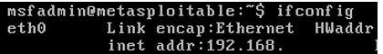
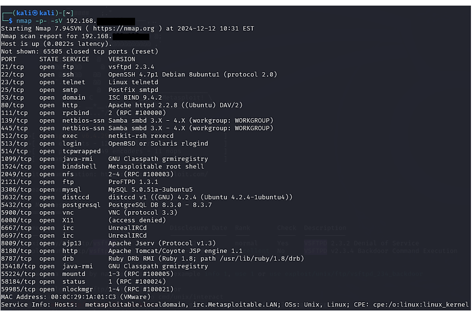
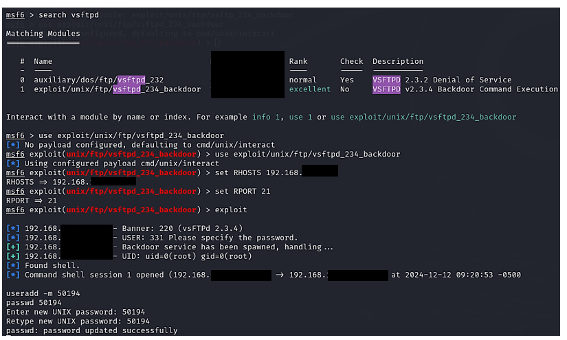

# VSFTPD Backdoor Exploitation Lab 2024

This repository documents my self-initiated security lab where I wanted to challenge myself to see if I could perform a complete attack chain against a deliberately vulnerable target.  
I set up Metasploitable 2 and Kali Linux to simulate a real penetration testing scenario.  
The goal was to identify vulnerabilities, exploit them step by step, create a new user on the system, and document every action.  
This project allowed me to practice professional penetration testing methodology while building a structured, evidence-based report.

---

## Table of Contents
- [Objectives](#objectives)
- [Tools Used](#tools-used)
- [Lab Setup](#lab-setup)
- [Attack Walkthrough](#attack-walkthrough)
- [Key Findings](#key-findings)
- [Lessons Learned](#lessons-learned)
- [References](#references)

---

## Objectives
- Practice reconnaissance, scanning, exploitation, and post-exploitation in a safe lab environment  
- Gain hands-on experience with Metasploit and vulnerability exploitation  
- Document every step with screenshots and explanations  
- Simulate a realistic attacker workflow  
- Reflect on mitigations and hardening techniques

---

## Tools Used
- **Metasploitable 2** (vulnerable target machine)
- **Kali Linux** (attacker machine)
- **Metasploit Framework**
- **Nmap** (port scanning and service enumeration)

---

## Lab Setup
The lab was created using two virtual machines on a local network:
- **Metasploitable 2** (target) running on VirtualBox  
- **Kali Linux** (attacker) running on VirtualBox  

The target was configured to obtain a local IP address that could be scanned from Kali Linux.

---

## Attack Walkthrough

### Step 1: Finding the Target IP
The first step was to identify the IP address of the Metasploitable 2 machine using `ifconfig`.

---

### Step 2: Scanning with Nmap
I ran a full port and service version scan to discover open services and detect potential vulnerabilities.

Key discovery: **vsftpd 2.3.4** was running on port 21, a version known to have a backdoor vulnerability.

---

### Step 3: Starting Metasploit
I launched Metasploit using `msfconsole` to search for exploits.

---

### Step 4: Finding and Running the Exploit
I searched for "vsftpd" inside Metasploit, found the backdoor exploit, set the target IP (RHOST) and port (RPORT), and executed the exploit.

The exploit succeeded and gave me a remote shell on the target machine.

---

### Step 5: Creating a New User
Inside the shell, I created a new user account and set a password, proving that I had full control of the system.

---

### Step 6: Verifying Access
Finally, I logged in as the newly created user and verified access using the `whoami` command.

This confirmed successful exploitation and persistence.

---

## Key Findings
- **FTP Service Vulnerability:** vsftpd 2.3.4 contains a backdoor that allows remote shell access.  
- **Weak Network Segmentation:** The machine was fully reachable and unprotected.  
- **Privilege Escalation Risk:** Creation of new users shows how attackers could maintain access.

---

## Lessons Learned
- Proper patch management and service hardening are critical to prevent such attacks.  
- Unnecessary services should be disabled, especially those with known vulnerabilities.  
- Network segmentation and access controls can limit attacker movement inside networks.

---

## References
- Offensive Security. (n.d.). *Metasploitable 2 Exploitability Guide*.  
- Rapid7. (n.d.). *Metasploit Framework Documentation*.  
- Nmap.org. (2024). *Nmap Reference Guide*.  

---

*Created by **Mahamed Maki Saine** – Cybersecurity Enthusiast | Ethical Hacker | AI Learner*
