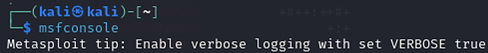

# VSFTPD Backdoor Lab 2024

This project documents my independent lab work where I explored and exploited the VSFTPD 2.3.4 backdoor vulnerability on Metasploitable 2.  
The goal was to simulate a realistic attack chain, practice ethical exploitation techniques, and strengthen my understanding of a structured penetration testing workflow.

---

## Table of Contents

- [Objectives](#objectives)
- [Step 1 Finding the Target IP](#step-1-finding-the-target-ip)
- [Step 2 Scanning with Nmap](#step-2-scanning-with-nmap)
- [Step 3 Starting Metasploit](#step-3-starting-metasploit)
- [Step 4 Searching and Configuring the Exploit](#step-4-searching-and-configuring-the-exploit)
- [Step 5 Restarting and Logging In](#step-5-restarting-and-logging-in)
- [Step 6 Verifying Access](#step-6-verifying-access)
- [Lessons Learned](#lessons-learned)

---

## Objectives

- Identify the IP address of the target machine  
- Perform a full Nmap scan and enumerate open ports  
- Launch Metasploit and search for the VSFTPD backdoor exploit  
- Configure and execute the exploit to gain a remote shell  
- Create a new user on the target machine  
- Verify persistence by logging in as the new user  

---

## Step 1: Finding the Target IP

I started by logging into Metasploitable 2 as **msfadmin** and running `ifconfig` to get the IP address.

---

## Step 2: Scanning with Nmap

Using Kali Linux, I ran a full port scan with service detection to identify running services.  
The scan revealed that the FTP service was running **vsftpd 2.3.4**, which is a known vulnerable version.

---

## Step 3: Starting Metasploit

I launched Metasploit using `msfconsole` to prepare for exploitation.

---

## Step 4: Searching and Configuring the Exploit

I searched for `vsftpd` in Metasploit, selected the `vsftpd_234_backdoor` exploit, set `RHOSTS` to the target IP and `RPORT` to 21, then executed the exploit.  
Once the session opened, I created a new user with `useradd` and set a password.

---

## Step 5: Restarting and Logging In

After exploitation, I restarted Metasploitable 2 and logged in as the new user to confirm access.

---

## Step 6: Verifying Access

Finally, I used the `whoami` command to confirm that I was successfully logged in as the new user.

---

## Lessons Learned

This lab gave me hands-on experience with a real vulnerability in a safe environment.  
I reinforced the value of network segmentation, service hardening, and keeping software patched to prevent attackers from exploiting known backdoors.  
The step by step process also improved my documentation habits and evidence collection.

---

*Created by **Mahamed Maki Saine** – Cybersecurity Enthusiast | Ethical Hacker | AI Learner*

